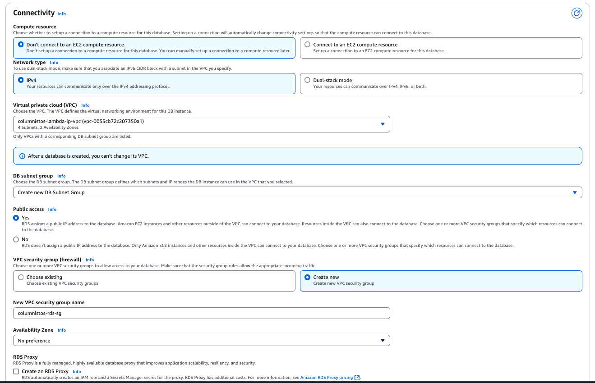

# ColumnistosJS

### 🔨 en construcción 🚧

Soy una bot que reporta los porcentajes de representación de género diarios en las columnas de opinión de periódicos. Soy hija de [columnistos](https://github.com/columnistos/columnistos) escrita en NodeJS.

Soy capaz de publicar _woots_ a [Wafrn](https://app.wafrn.net/blog/columnistoscr), una red social de [código abierto](https://github.com/gabboman/wafrn) que está federada con Mastodon y Bluesky.

Puedo correr localmente con Docker y uso Serverless para correr en AWS.

## Desarrollo local

Crea una cuenta en [Wafrn](https://app.wafrn.net). Crea el archivo `.env` usando como base `.env.example`.
y completa las variables de ambiente.

```bash
npm i
docker-compose up -d # Starts database in the background
```

### Base de datos local

Usa un programa como TablePlus para conectarse a la base de datos local para correr la configuración

```sql
CREATE DATABASE columnistos;
CREATE USER IF NOT EXISTS '<<DB_USER>>' IDENTIFIED BY '<<DB_PWD>>';
GRANT ALL PRIVILEGES ON columnistos.* TO '<<DB_USER>>';
FLUSH PRIVILEGES;
```

## Configurar un proyecto nuevo en AWS

### Deployment local a la nube

<details>
<summary>Leer instrucciones</summary>

```bash
npm i -g serverless@3.40.0
```

En AWS, en el menú superior derecho elige "Security credentials". Crea un nuevo set de Access keys para CLI y guarda el csv a la computadora. Llena el siguiente comando con esos valores.

```bash
serverless config credentials --provider aws --key XXXX --secret XXXX
```

</details>

### Instrucciones con MFA

<details>
<summary>Leer instrucciones</summary>

Si tienes MFA habilitado, guarda de la misma página Security credentials el identificador de tu dispositivo MFA que tiene el patrón `arn:aws:iam:xxx`.

Vamos a generar unas credenciales temporales que vamos a guardar en un perfil llamado `mfa`. Por defecto expiran en un día.
Para que Serverless sepa que queremos usar estas credenciales temporales, hay que pasarle el parámetro `--aws-profile mfa`.

```bash
# hay que deshabilitar estas variables primero
unset AWS_ACCESS_KEY_ID
unset AWS_SECRET_ACCESS_KEY
# este comando devuelve con json con los valores temporales para aws_access_key_id, aws_secret_access_key y aws_session_token
aws sts get-session-token --serial-number arn:aws:iam:xxx --token-code [token-de-dispositivo-mfa]
# ingresa los valores temporales de key id and key secret del comando anterior
aws configure --profile mfa
# ingresa el valor temporal de session token
aws configure --profile mfa set aws_session_token [session-token-del-comando-anterior]
export AWS_PROFILE="mfa" # talvez no es completamente necesario
```

#### Comando para hacer deployment

```bash
npm run local-deploy
```

</details>

### Deployment desde GitHub Actions

<details>
<summary>Leer instrucciones</summary>

Cuando ocurre un commit en `main`, un [GitHub Workflow](.github/workflows/build-and-deploy.yml) actualiza el deployment en AWS. Para que Github sea capaz de hacer cambios en AWS, hay que darle un rol en nuestra cuenta de AWS.

1. Crear un Identity provider en AWS.
   En la consola de IAM, elije Identity providers y Add provider. En Configure provider, elije OpenID Connect.
   En Provider URL, usa `https://token.actions.githubusercontent.com`. Para la audiencia, usa `sts.amazonaws.com`.
2. Asigna un rol IAM al identity provider.
   En la página del identity provider, elije Assign role. Elije crear un nuevo rol.
   El nombre puede ser `GitHubAction-AssumeRoleWithAction` y para los permisos asigna los siguientes:

```
AmazonAPIGatewayAdministrator
AmazonRoute53AutoNamingFullAccess
AmazonRoute53ReadOnlyAccess
AmazonS3FullAccess
AWSCertificateManagerReadOnly
AWSCloudFormationFullAccess
AWSLambda_FullAccess
AmazonAPIGatewayPushToCloudWatchLogs
IAMFullAccess
CloudWatchLogsFullAccess
```

También es necesario agregar la siguiente política inline

```
{
  "Version": "2012-10-17",
  "Statement": [
    {
      "Sid": "Statement1",
      "Effect": "Allow",
      "Action": [
        "events:DescribeRule",
        "events:PutRule",
        "events:PutTargets"
      ],
      "Resource": [
        "*"
      ]
    }
  ]
}
```

3. Copia el ARN del rol a la variable de ambiente de GitHub `AWS_ROLE_TO_ASSUME`.

4. Configura los secretos de ambiente de GitHub `AWS_ACCESS_KEY_ID` y `AWS_SECRET_ACCESS_KEY`.

</details>

### Crear VPC

<details>
<summary>Leer instrucciones</summary>

1. Siguiendo las instrucciones de (este artículo)[https://medium.com/financial-engines-techblog/aws-lambdas-with-a-static-outgoing-ip-5174a1e70245], crea un VPC, 1 subnet privada y 1 pública en dos availability zones, una internet gateway, un route table adicional para las subnets pública y un NAT Gateway para el route table default.

2. En la route table pública, en el tab de Routes, hay que cambiar el route 0.0.0.0/0 para que dirija al Internet gateway. En el tab de Subnet associations, agrega las dos subnets públicas de manera explícita.

3. En la route table default, recomiendo renombrarla para indicar que es la privada. Agregar la ruta 0.0.0.0/0 hacia el NAT Gateway.

4. Agregar un security group para el lambda, con una regla Outbound de HTTPs para 0.0.0.0/0

</details>

### Crear base de datos en la nube

<details>
<summary>Leer instrucciones</summary>

1. Crear una base de datos MariaDB en free tier y elije una contraseña segura.

2. En la sección de Connectivity, elije la VPC, crea un nuevo subnet group para la db, permite acceso público, elije crear un nuevo VPC group llamado `columnistos-rds-sg` y no deja preferencia para el availability zone.



3. Usando un programa como TablePlus, conéctate a la base de datos por su nombre para correr [el script para configurar el usuario y el schema](#base-de-datos-local) y [el de crear las tablas](./db/setup.sql).

</details>

### Configurar variables en el repositorio

<details>
<summary>Leer instrucciones</summary>

Configurar las siguientes variables de ambiente en GitHub

- AWS_LAMBDA_SG
- AWS_RDS_SG
- AWS_SUBNET_ID_1
- AWS_SUBNET_ID_2
- AWS_SUBNET_ID_3
- AWS_SUBNET_ID_4
- DB_HOST
- DB_USER
- CRAWLER_DIR
- ADMIN_HANDLES

Configurar el siguiente secreto en GitHub

- DB_PWD

</details>

### Verificar security groups

<details>
<summary>Leer instrucciones</summary>

El security group de rds solamente debe de tener dos inbound rules

- MySQL/Aurora del IP del local (se puede eliminar después de crear las tablas)
- MySQL/Aurora del security group del lambda

El security group de lambda solamente debe de tener dos outbound rules

- MySQL/Aurora hacia el security group del rds
- HTTPS hacia 0.0.0.0/0
</details>
